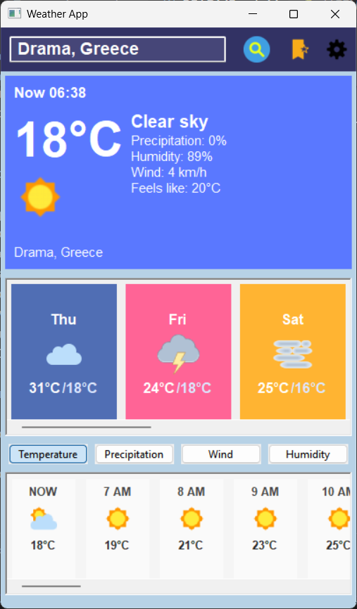
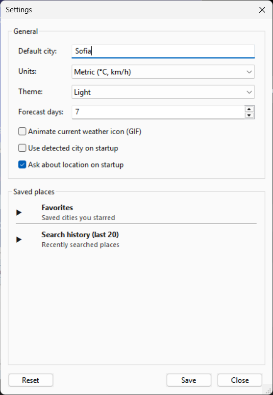
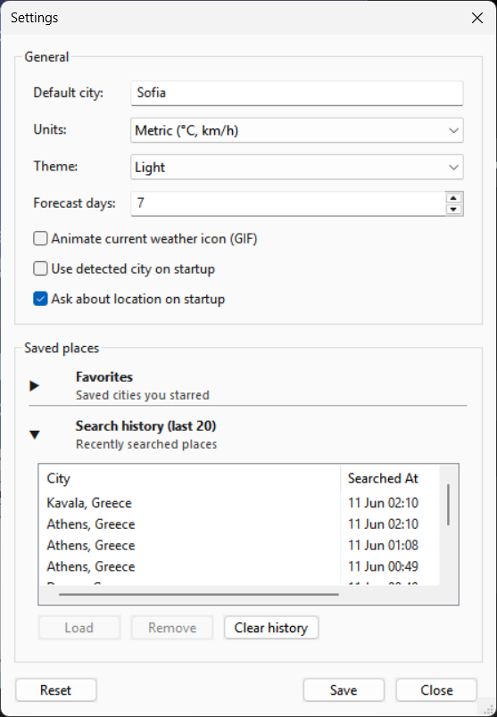

# Weather App

A desktop weather application built with **Python**, **wxPython**, **Open-Meteo**, and **SQLite**.

The app provides current weather, daily forecasts, hourly weather views, favorites, search history, light/dark themes, animated weather icons, local caching, and network retry handling.

## Features

* Search weather by city name
* Accepts inputs like `Kavala Greece` and displays a resolved city/country name
* Current weather panel with:

  * Temperature
  * Weather description
  * Feels-like temperature
  * Precipitation probability
  * Humidity
  * Wind speed
* Daily forecast cards
* Hourly forecast strip with multiple modes:

  * Temperature
  * Precipitation
  * Wind
  * Humidity
* Sunrise and sunset markers in the hourly forecast
* Day/night icon variants where available
* Optional animated current weather icons using GIFs
* Favorites system for saved cities
* Search history with duplicate protection
* Light and dark themes
* Settings dialog for:

  * Default city
  * Units: metric / imperial
  * Theme
  * Forecast days
  * Animated icon preference
  * Startup location behavior
* Cache-then-refresh behavior:

  * Shows cached weather immediately when available
  * Refreshes fresh data in the background
* Network retry handling:

  * Retries temporary network failures
  * Shows reconnect status
  * Provides a manual Retry button after failed attempts
* Local persistent storage with SQLite
* Unit and integration tests

## Tech Stack

* **Python**
* **wxPython** for the desktop GUI
* **Open-Meteo API** for weather and geocoding data
* **SQLite** for favorites and search history
* **pytest** for testing
* **requests** for HTTP requests

## Project Structure

```text
weather_app/
├── app.py
├── domain/
│   ├── models.py
│   ├── modes.py
│   └── settings.py
├── services/
│   ├── errors.py
│   ├── location.py
│   ├── openmeteo.py
│   ├── settings_store.py
│   ├── storage.py
│   └── ttl_cache.py
├── ui/
│   ├── cache_refresh_manager.py
│   ├── current_weather_panel.py
│   ├── current_weather_presenter.py
│   ├── frame.py
│   ├── hour_tile.py
│   ├── hour_tile_presenter.py
│   ├── request_state.py
│   ├── saved_places_panels.py
│   ├── settings_dialog.py
│   ├── theme.py
│   ├── weather_card.py
│   └── weather_card_presenter.py
├── utils/
│   ├── formatters.py
│   ├── icon_logic.py
│   ├── icons.py
│   ├── logging_config.py
│   └── paths.py
├── assets/
│   ├── png/
│   └── gif/
└── tests/
```

## Architecture Overview

The project is organized into separate layers:

### `domain/`

Contains the core data models and weather display modes.

Examples:

* `WeatherData`
* `CurrentSnapshot`
* `DailyForecast`
* `HourlySeries`
* `Settings`
* `HourlyMode`

### `services/`

Contains non-UI logic.

Responsibilities include:

* Fetching weather data from Open-Meteo
* Geocoding city names
* Detecting location from IP
* Retrying network requests
* Storing favorites and search history in SQLite
* Saving/loading user settings
* Managing TTL cache behavior

### `ui/`

Contains wxPython UI classes and UI coordination logic.

Responsibilities include:

* Main application frame
* Current weather panel
* Daily forecast cards
* Hourly forecast tiles
* Settings dialog
* Favorites/history panels
* Theme handling
* Cache-then-refresh coordination
* Request state and retry behavior

### `utils/`

Contains reusable helpers for:

* Date/time formatting
* Icon selection logic
* Icon and animation loading
* Paths
* Logging configuration

## Installation

### 1. Clone the repository

```bash
git clone https://github.com/KristineLio/WeatherApp.git
cd WeatherApp
```

### 2. Create a virtual environment

On Windows:

```bash
python -m venv .venv
.venv\Scripts\activate
```

On macOS/Linux:

```bash
python -m venv .venv
source .venv/bin/activate
```

### 3. Install dependencies

```bash
pip install -r requirements.txt
```

If you do not have a `requirements.txt` yet, generate one after installing the needed packages:

```bash
pip freeze > requirements.txt
```

Main dependencies include:

```text
wxPython
requests
pytest
```

## Running the App

Run from the project root:

```bash
python -m weather_app.app
```

Or, depending on your structure:

```bash
python weather_app/app.py
```

## Running Tests

Run all tests:

```bash
pytest
```

Run with verbose output:

```bash
pytest -v
```

## Local Data

The app stores local user data outside the project folder.

Settings are saved in:

```text
~/.weather_app/settings.json
```

Favorites and search history are saved in:

```text
~/.weather_app/weather.db
```

These files are local runtime data and should not be committed to Git.

## Logging

The app uses Python logging.

Default log level:

```text
INFO
```

To enable debug logs:

On Windows PowerShell:

```powershell
$env:WEATHER_APP_LOG_LEVEL="DEBUG"
python -m weather_app.app
```

On macOS/Linux:

```bash
WEATHER_APP_LOG_LEVEL=DEBUG python -m weather_app.app
```

## Weather Data Provider

This project uses the free Open-Meteo API:

* Weather forecast data
* Geocoding/city search
* No API key required

## Notable Implementation Details

### Cache-Then-Refresh

When cached weather data is available, the UI displays it immediately. A background refresh then fetches fresh data from the weather provider.

This improves perceived speed while still keeping the displayed weather up to date.

### Retry Handling

The app separates different failure types:

* Invalid city input
* Network errors
* Provider/API errors

Temporary network issues can trigger retry behavior, while invalid city names are shown directly to the user.

### Presenters

The app uses presenter-style modules to convert domain data into simple view data before rendering.

This keeps UI widgets simpler and makes the formatting logic easier to test.

Examples:

* `current_weather_presenter.py`
* `weather_card_presenter.py`
* `hour_tile_presenter.py`

### Local Storage

Favorites and search history are stored with SQLite.

Search history is limited so the local database does not grow forever. Very recent duplicate searches for the same top city are updated instead of inserted repeatedly.

## Screenshots

Screenshots images saved inside  `screenshots/` folder.

```markdown




```

## Possible Future Improvements

* Package the app as a Windows executable
* Add more detailed daily forecast information
* Add weather alerts if supported by a provider
* Add map/location picker
* Add more animated icons
* Improve accessibility and keyboard navigation
* Add automatic update checks
* Add CI workflow for running tests on GitHub Actions

## License

This project is for learning and portfolio purposes.

This project is licensed under the MIT License.

See the [LICENSE](LICENSE) file for details.

## Author

Created by Christina Lioliosidou.
